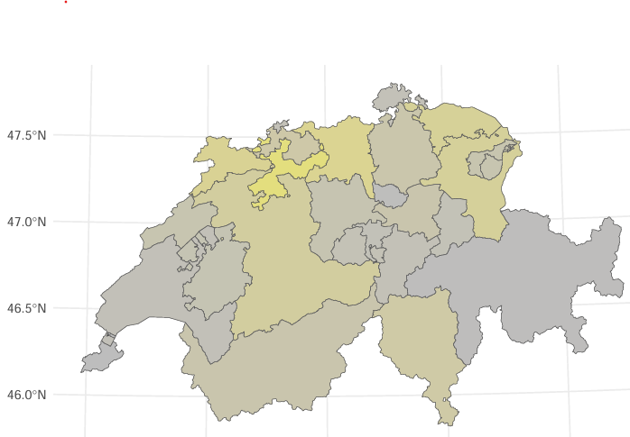

<!-- This Readme file is based on the template found here: https://github.com/othneildrew/Best-README-Template/blob/main/BLANK_README.md  -->

<!-- PROJECT LOGO -->
 

  

# Insight into the development of the Swiss housing market over the past decade

<!-- TABLE OF CONTENTS -->
<li><a href="#about-the-project">About The Project</a></li>
<li><a href="#project-idea">Project Idea</a></li>
<li><a href="#data-sources">Data Sources</a></li>
<li><a href="#results">Results</a></li>

# About The Project
This project provides an in-depth analysis of the Swiss housing market over the past decade. The goal is to give the client a clear understanding of the development of vacancy rates and the factors influencing the housing market in Switzerland. By examining trends and patterns, the project aims to highlight regional and linguistic variations and the potential impact of tax rates on vacancy rates. The results and findings can inform further studies or business decisions related to housing demand and market trends.

# Project idea
The study focuses on analyzing historical and current data to uncover trends in Switzerland’s housing market. 
It aims to:

- Understand how vacancy rates have evolved over the last decade.
- Explore regional and linguistic disparities within the housing market.
- Investigate the influence of factors such as tax rates on vacancy rates. Through visualizations and statistical analyses, the study offers insights into the relationship between these variables, supporting better decision-making in the housing sector.

# Data Sources
The analysis is based on three main datasets:

1. **Empty Dwelling Census:** Annual data from the federal government, including the number of vacant apartments and the vacancy rate by municipality. [Vacancy Rates]

2. **Tax Burden of Municipalities:** Information on income, wealth, profit, and capital tax rates by municipality and canton. [Tax Rates]

3. **List of Localities:** Geographical and linguistic data for Swiss municipalities, including canton affiliation, language, and coordinates. [Municipalities]

The datasets were joined and cleaned to create a consolidated data frame for analysis.

# Results
The results reveal several key trends and insights about the Swiss housing market:

- **Vacancy Rates:** Vacancy rates steadily increased from 2010 to 2019 but have declined since, likely influenced by factors such as reduced construction and emigration during the COVID-19 pandemic.

- **Regional Disparities:** Urban cantons (e.g., Zurich, Geneva) have consistently lower vacancy rates due to higher demand and better services, while rural cantons (e.g., Jura, Appenzell) exhibit higher vacancy rates.

- **Tax Rates:** Cantons with lower tax rates (e.g., Zug) tend to have lower vacancy rates, but the relationship between tax rates and vacancy rates is not strongly statistically significant.

- **Apartment Types:** Three- and four-room apartments have the highest vacancy rates, reflecting their higher supply and demand compared to one- and six-room apartments.

- **Linear regression models** suggest that other factors, such as urbanization and infrastructure, may have a greater influence on vacancy rates than tax rates alone.

The comprehensive insight into the project results can be found here: [Report]

<!-- MARKDOWN LINKS & IMAGES -->
[Vacancy Rates]: https://www.bfs.admin.ch/bfs/de/home/statistiken/bau-wohnungswesen/wohnungen/leerwohnungen.html
[Municipalities]: https://www.swisstopo.admin.ch/de/amtliches-ortschaftenverzeichnis
[Tax Rates]: https://www.estv.admin.ch/estv/de/home/die-estv/steuerstatistiken-estv/steuerbelastung-schweiz/belastung-gemeinden.html
[Report]: https://github.com/Carlomk1/swiss-real-estate-development/blob/25cce85f0c29de1929ba390d751afb59e8e88d83/real-estate-development_report.pdf